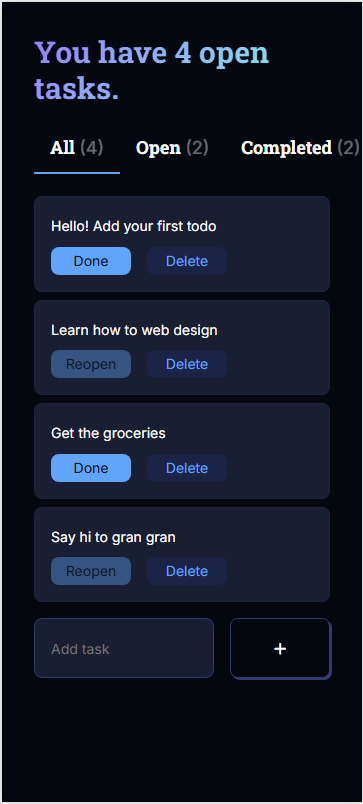
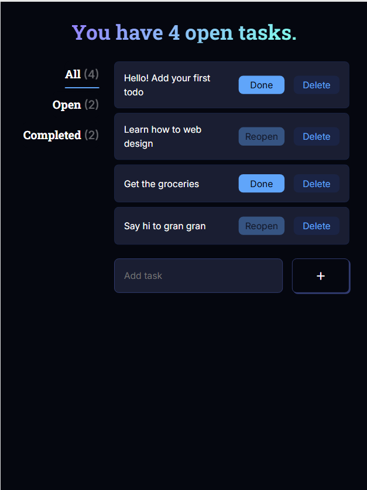

# ReactJS Todo App

Code along with [jamezmca](https://github.com/jamezmca)

## Features

- Add tasks
- Filter tasks by All/Open/Completed
- Change the status of tasks with Done button
- Delete tasks with Delete button
- Click to edit tasks
- Keep tasks in local storage
- Responsive design

## Solutions

- Add 'editing' key in todos and editValue state to edit tasks
- ~~Implement uuid to identify tasks~~

## Images

  
  

