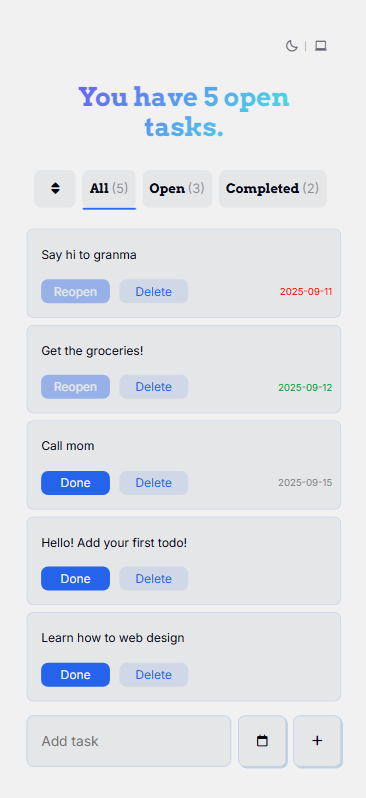
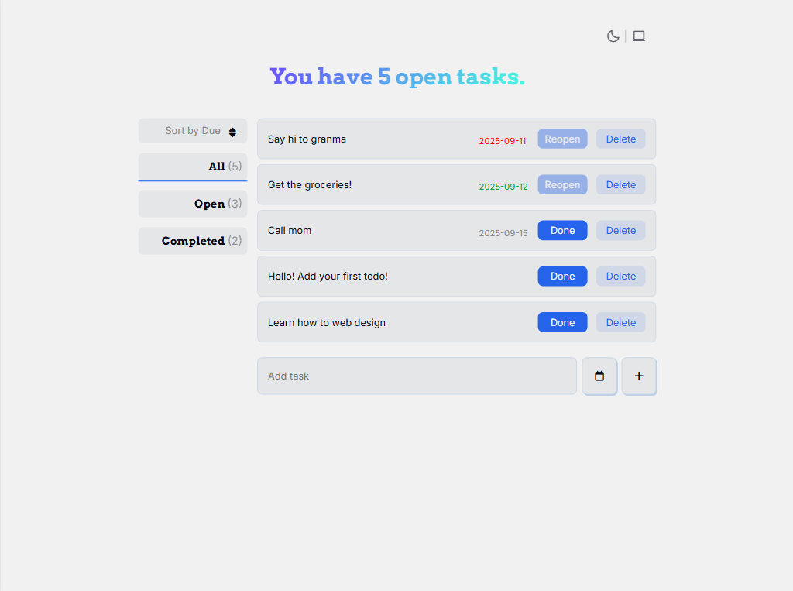
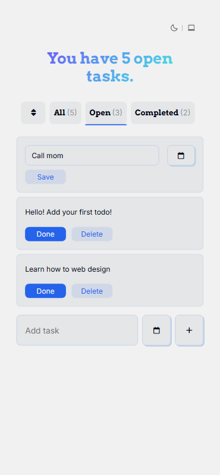
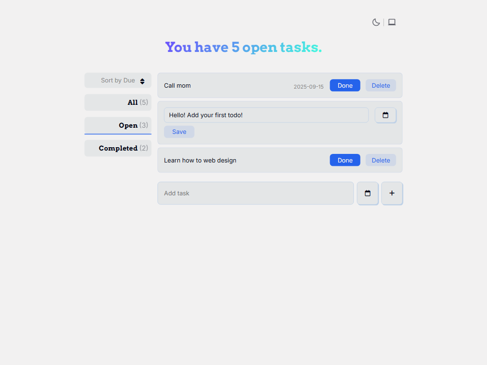
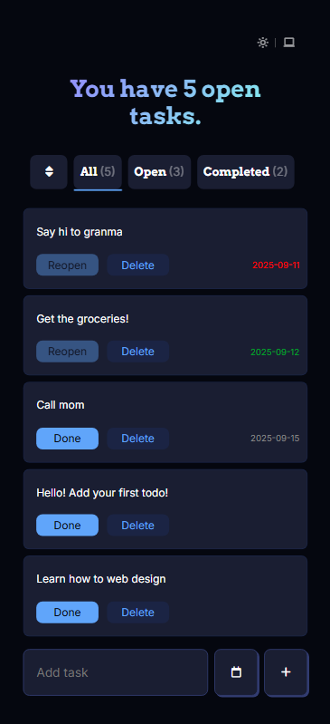
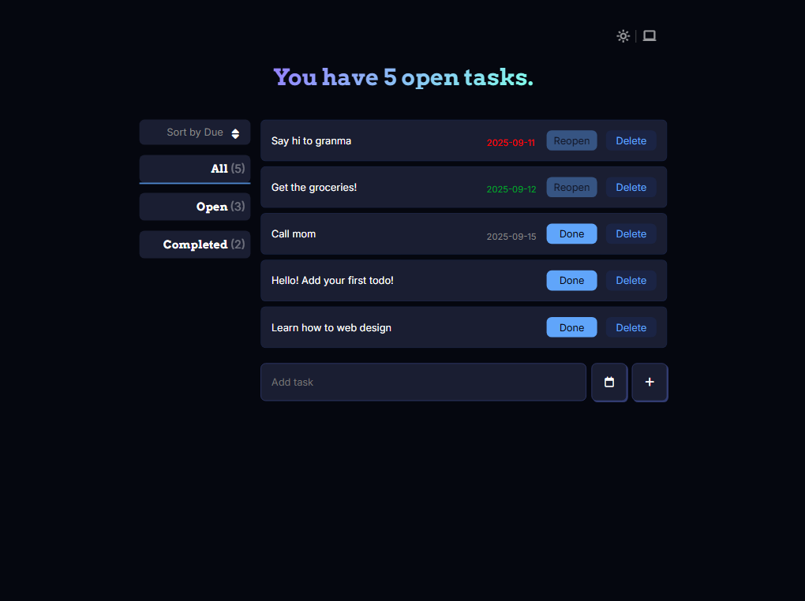
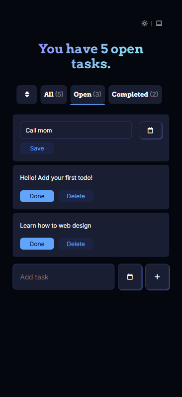
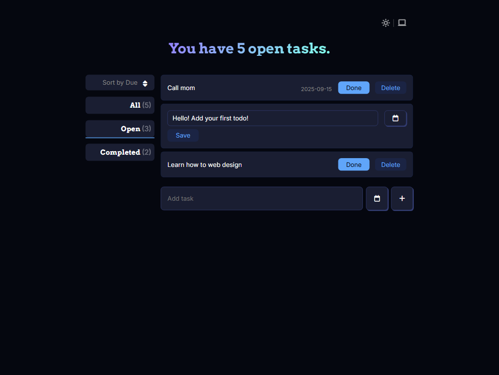
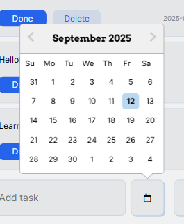

# ReactJS Todo App

Code along with [jamezmca](https://github.com/jamezmca)

## Features

- Add tasks
- Change the status of tasks with Done button
- Delete tasks with Delete button
- Filter tasks by All/Open/Completed
- **[Update]** Responsive design
- **[New]** Keep tasks in local storage
- **[New]** Switch between Dark, Light, and System themes
- **[New]** Click to edit tasks
- **[New]** Set due dates
- **[New]** Sort tasks by due dates
- **[New]** Make today/overdue tasks noticeable
- **[Fix]** No multiple editings
- **[Fix]** React DatePicker UI

## Solutions

- Add `editing` key in todos and editValue state to edit tasks
- Use `useContext` to implement theme switchers
- Add `react-datepicker`
- Implement uuid to identify tasks
- Use `useRef` to click outside detection
- Change fragment (`<>`) with `useRef` to `
` to modify CSS layout

## Images

Light Mode

  
  

  

 

Light Mode (editing)

  

  
  

 

Dark Mode

  
  

  

 

Dark Mode (editing)

  
  

React DatePicker

