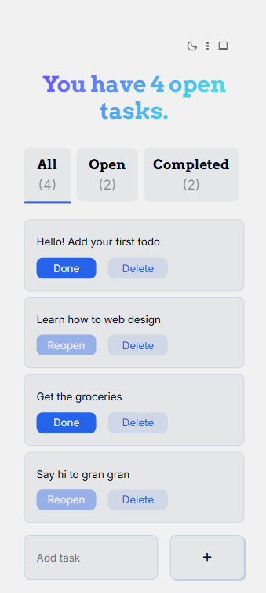
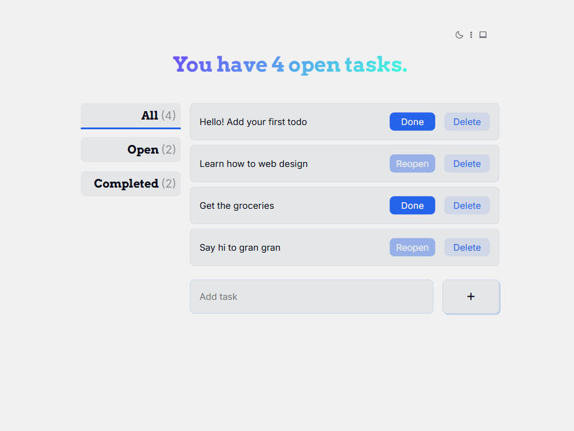
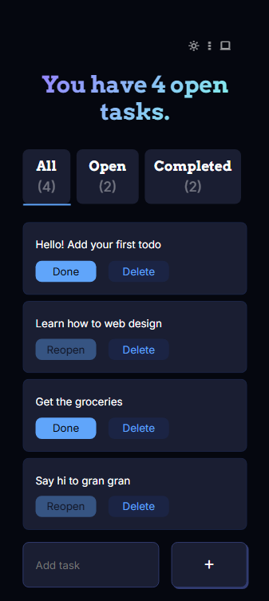
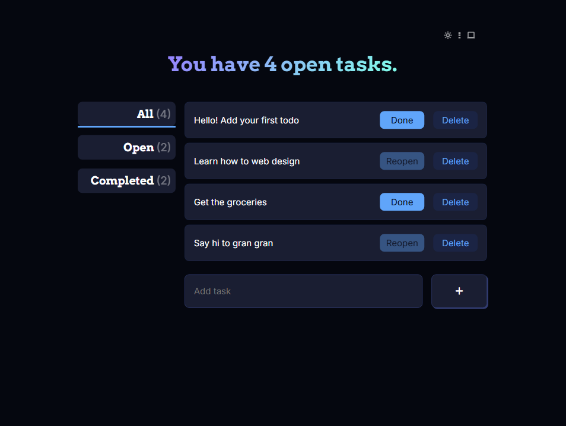

# ReactJS Todo App

Code along with [jamezmca](https://github.com/jamezmca)

## Features

- Add tasks
- Filter tasks by All/Open/Completed
- Change the status of tasks with Done button
- Delete tasks with Delete button
- Click to edit tasks
- Keep tasks in local storage
- Responsive design
- Switch between Dark, Light, and System themes

## Solutions

- Add `editing` key in todos and editValue state to edit tasks
- Use `useContext` to implement theme switchers
- ~~Implement uuid to identify tasks~~

## Images

Light Mode

  
    

 

Dark Mode

  
  

